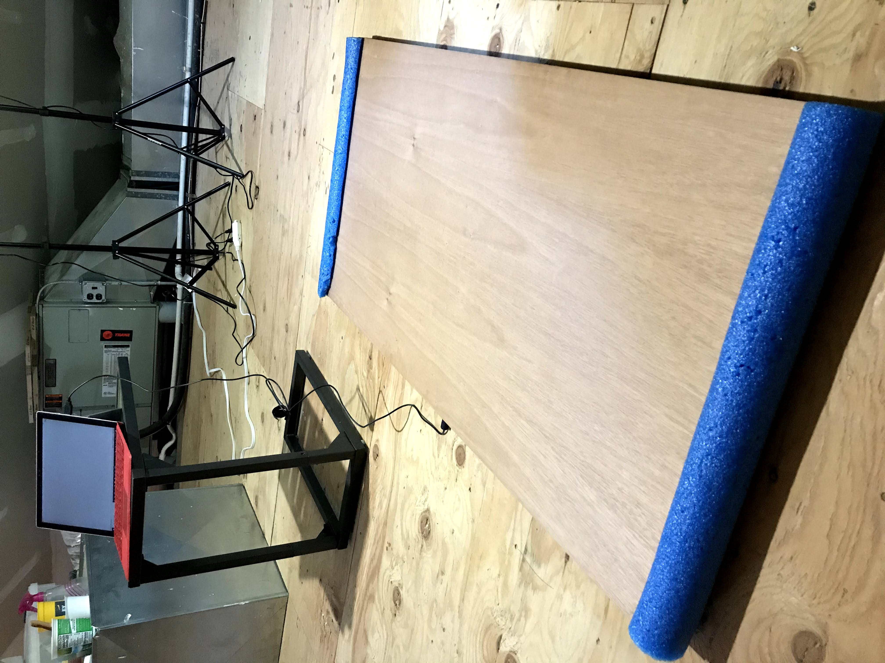
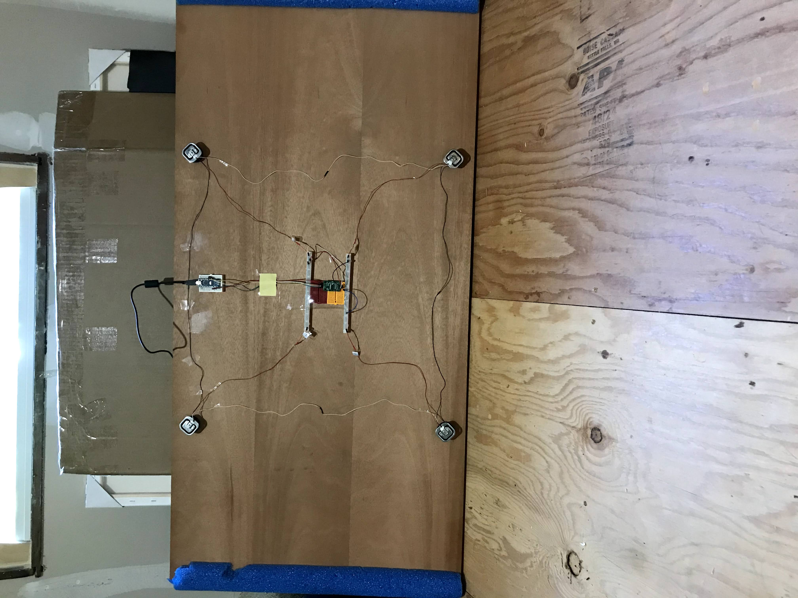
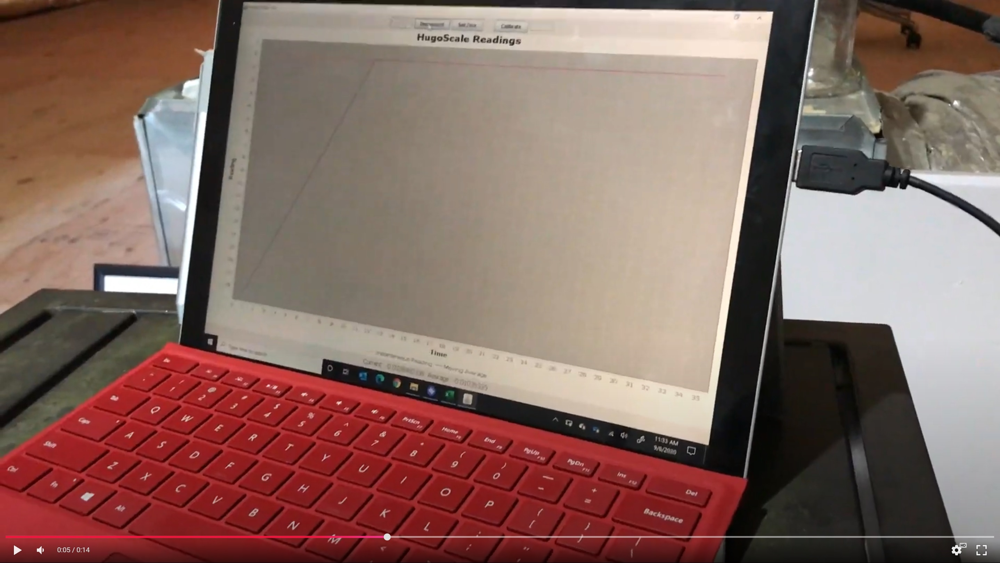
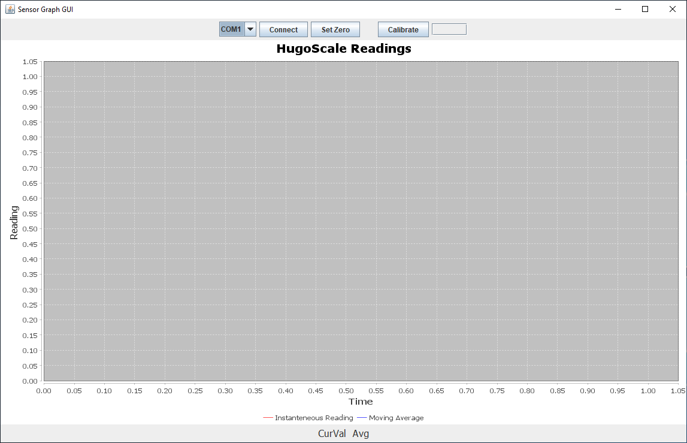

# HugoScale2 Gallery

## The Platform — Built for Hugo

  
*¾" plywood 2 ft × 4 ft platform — big enough for a full-grown German Shepherd to stand comfortably. Looks like a normal board on the floor, so Hugo trusts it.*

  
*Full view of the scale on its stand with blue foam edge protection.*

  
*Four load cells wired to HX711 and Arduino, all cleanly mounted under the plywood.*

## Software in Action

  
*Desktop app connected and displaying live weight on the laptop.*

### Live Sensor Graph GUI
  
*Real-time graph showing instantaneous weight (blue) + moving average (orange), COM port selector, Connect, Set Zero, and Calibrate buttons.*
