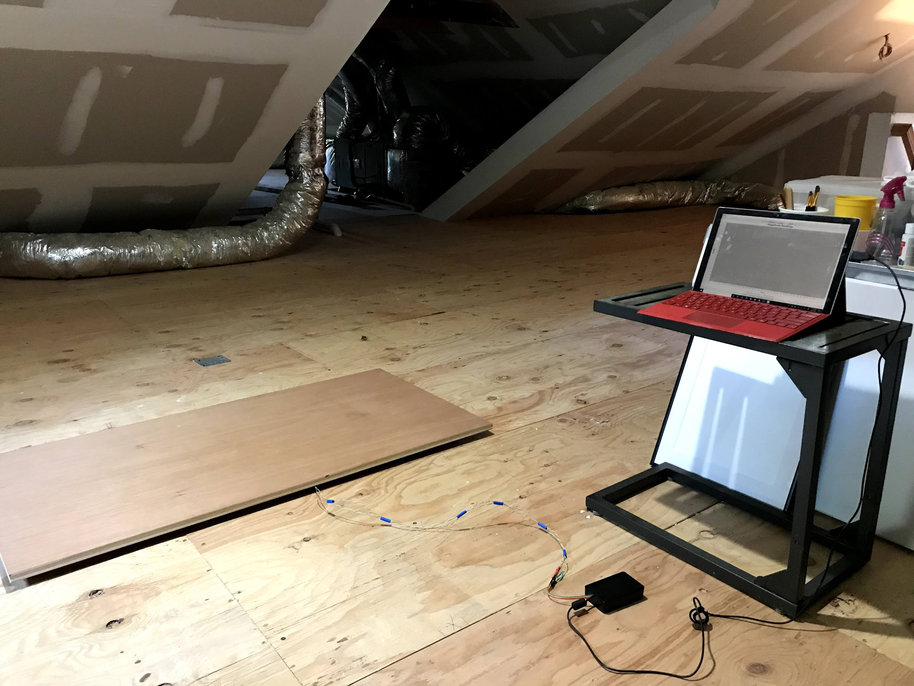

# HugoScale2

**HX711-based DIY digital weighing scale** built with **Arduino** firmware and a **Java** desktop client.  

**Made for Hugo — my 100+ lb German Shepherd Dog.**

## Why HugoScale2?

Hugo is a very large GSD who needs regular weighing to monitor his health.  
All commercial “large-dog” platform scales I found were either:
- Tiny (not suitable for a 2×4 ft dog stance), or
- Expensive ($300–$600+)

Hugo also doesn’t trust “experiments,” so the scale had to look completely normal — just a sturdy, unassuming **¾" plywood platform measuring 2 ft × 4 ft**.  
He walks onto it like it’s part of the floor.

This is the **second iteration** of the project.  
→ First version (Processing + C++): [hugoscale](https://github.com/bitosaur/hugoscale)

**Bonus motivation:** I also wanted to brush up on Java, so I rewrote the desktop GUI in Java Swing.

## Overview

HugoScale2 is a complete open-source weighing platform:
- Four load cells under a 2×4 ft plywood sheet
- HX711 24-bit ADC
- Arduino firmware streaming weight data over USB serial
- Clean Java desktop GUI with live graph, tare, and calibration

Perfect for large dogs, workshops, or any custom weighing need.

## Features

- 24-bit high-resolution measurement via HX711
- Real-time serial streaming (instant + moving average)
- Live graphing Java Swing GUI
- One-click **Set Zero** (tare) and **Calibrate**
- Extremely sturdy ¾" plywood platform (2 ft × 4 ft)
- Low-cost, fully open-source (MIT license)

## Hardware Requirements

- Arduino board (Uno/Nano/etc.)
- HX711 Load Cell Amplifier
- 4× strain-gauge load cells (choose capacity for your max weight)
- **¾" plywood: 24" × 48"** (the actual scale platform)
- Mounting hardware, wires, USB cable

**Platform size chosen specifically so Hugo could stand naturally without it feeling like a “scale.”**

## Software Requirements

- Arduino IDE + HX711 library
- Java 8+ (JDK) for the desktop app

## Project Structure
